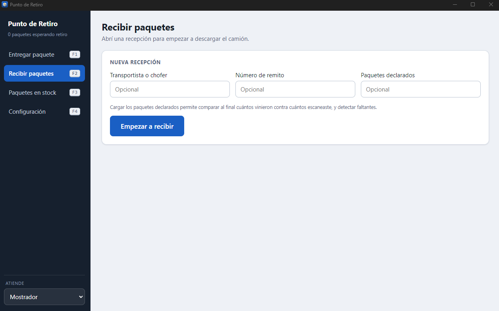
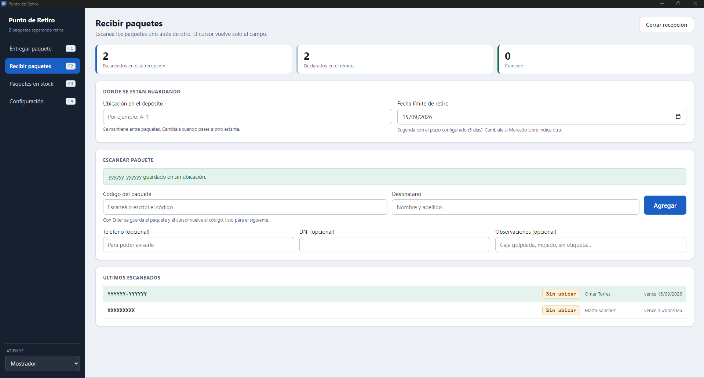
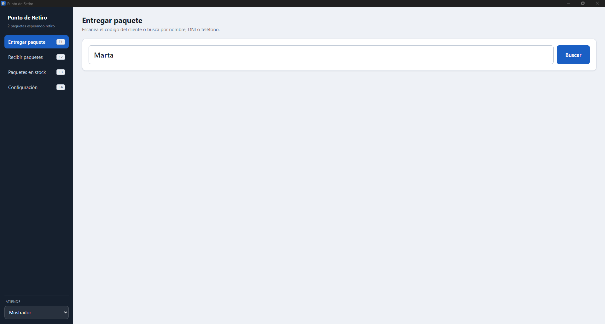
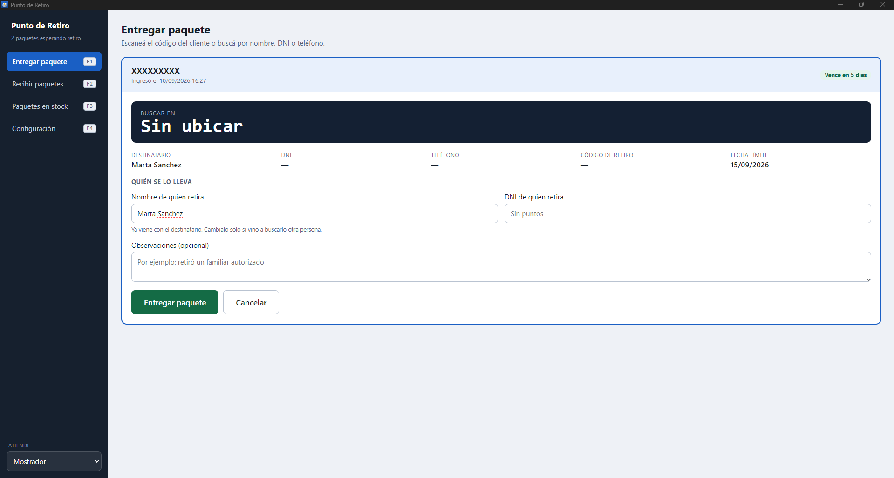
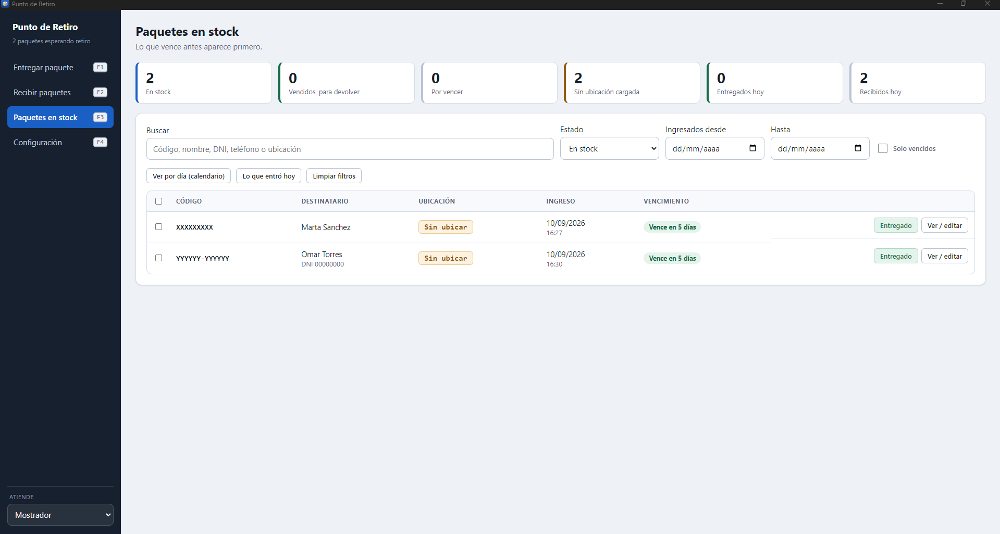
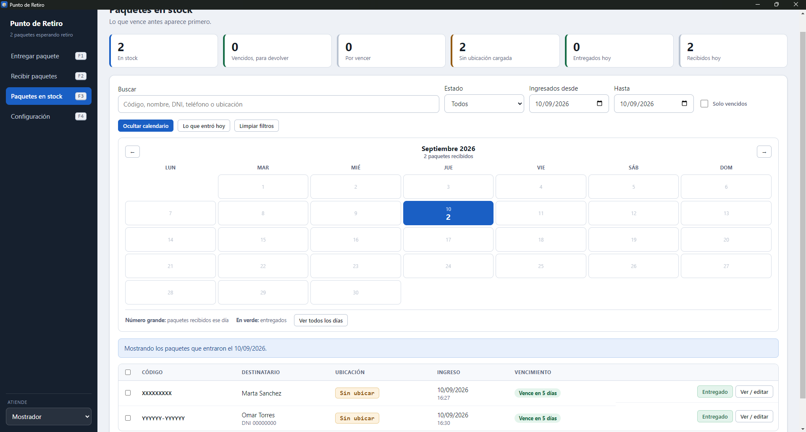

# Punto de Retiro

Aplicación de escritorio para gestionar un punto de retiro de paquetes de Mercado Libre.
Registra la entrada de la mercadería cuando llega el camión, la salida cuando el cliente
retira, y el pendiente: qué está guardado, dónde, y hasta cuándo.

Es un **control interno** para el dueño del local y sus empleados. No reemplaza el sistema
oficial de Mercado Libre: cubre lo que ese sistema no da — ubicación física en el depósito,
búsqueda instantánea, trazabilidad de quién recibió y entregó cada paquete, y alertas de
vencimiento.

---

## Capturas

### Recibir paquetes
Se abre un lote por cada llegada de camión. Si el remito declara cuántos paquetes vienen,
la aplicación avisa al cerrar si falta alguno.



El escaneo es continuo: la ubicación y la fecha quedan fijas entre paquetes, el cursor
vuelve solo al código, y avisa si un paquete está duplicado.



### Entregar paquete
La búsqueda acepta código, nombre, DNI o teléfono: sirve tanto si el cliente trae el código
como si solo dice su nombre.



Encontrado el paquete, muestra la ficha con **dónde está guardado en letra grande**, antes
de ir a buscarlo al depósito. Si lo retira un tercero, se cambia el nombre y queda
registrado quién se lo llevó.



### Stock
Semáforo por vencimiento, con lo que vence primero arriba. Cada fila tiene un botón verde
para marcar la entrega en un clic, y los vencidos se devuelven a Mercado Libre en tanda.



El calendario mensual muestra cuántos paquetes entraron y salieron cada día, y permite
entrar a un día con un clic. Reemplaza la carpeta de planillas de Excel, que era una hoja
por fecha.



---

## Funcionalidad

Cuatro pantallas, navegables con **F1** a **F4**:

| Pantalla | Qué hace |
|---|---|
| **Entregar** (F1) | Busca por código, nombre, DNI o teléfono. Muestra la ubicación en grande y registra quién retiró. |
| **Recibir** (F2) | Escaneo continuo por lote, detección de duplicados y comparación contra lo declarado en el remito. |
| **Stock** (F3) | Semáforo por vencimiento, calendario mensual, devolución masiva a ML. |
| **Configuración** (F4) | Plazo de retiro, operadores, ubicaciones y copias de seguridad. |

---

## Tecnologías

- **Electron 33** + **electron-vite**
- **React 18** + **TypeScript**
- **better-sqlite3** — base de datos local, sin servidor

---

## Instalación para desarrollo

```bash
npm install
npm run dev
```

> El archivo `.npmrc` del repositorio es **obligatorio**: fuerza a que `better-sqlite3` se
> descargue precompilado para Electron. Sin él, `npm install` falla intentando compilar con
> Visual Studio.

### Comandos disponibles

| Comando | Para qué |
|---|---|
| `npm run dev` | Levanta la app en modo desarrollo, con recarga automática |
| `npm run build` | Compila los tres procesos a `out/` |
| `npm run typecheck` | Verifica tipos sin compilar |
| `npm run dist` | Genera el instalador `.exe` en `release/` |
| `npm run datos-prueba` | Carga paquetes de ejemplo para recorrer la app |
| `npm run borrar-prueba` | Borra solo los de ejemplo (prefijo `DEMO-`) |

---

## Arquitectura

Electron con tres procesos separados, más una carpeta compartida:

- **`src/main/`** — Proceso principal. Es el único que toca la base de datos. Cada handler
  de IPC devuelve un sobre `Respuesta<T>` para que los errores lleguen legibles a la pantalla.
- **`src/preload/`** — Puente seguro. Expone `window.api` con `contextBridge`.
- **`src/renderer/`** — Interfaz en React. No tiene acceso a Node ni a la base: solo puede
  llamar a `window.api`.
- **`src/shared/`** — Tipos, contrato del puente y utilidades de fecha. Lo usan los tres lados.

### Modelo de datos

`paquetes` (el centro), `lotes` (cada llegada de camión), `operadores`, `configuracion` y
`movimientos` (bitácora de auditoría: solo se agregan filas, nunca se modifican ni se borran).

Un índice único parcial impide que el mismo código esté dos veces **en stock**, pero permite
que se repita en el historial si el paquete ya salió.

---

## Dónde viven los datos

`%APPDATA%\punto-retiro\datos\punto-retiro.db`, **fuera de la carpeta de instalación**. Por
eso reinstalar o actualizar la app no borra nada, y desinstalarla tampoco.

La copia diaria va a `datos\backups\` y se conservan las últimas 30. Configuración permite
elegir además una **segunda carpeta** (un pendrive, una carpeta de red) donde se duplica el
respaldo, para que un disco roto no se lleve la base y sus treinta copias juntas.

---

## Documentación

- **[INSTRUCCIONES.md](INSTRUCCIONES.md)** — Guía de uso para el local, sin tecnicismos.
- **[CLAUDE.md](CLAUDE.md)** — Contexto técnico, decisiones de diseño y notas de desarrollo.

---

## Estado

**MVP terminado y funcionando.** El próximo paso es instalarlo en la PC del local y usarlo
unos días con paquetes reales.

Pendientes:
1. Reportes y cierre de día para el dueño: cuánto entró y salió por período, devoluciones
   por vencimiento, actividad por operador.
2. Considerar un PIN por operador si el local necesita restringir quién entrega.
